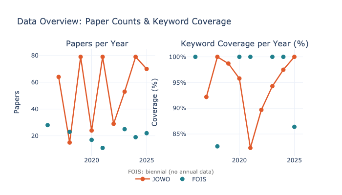
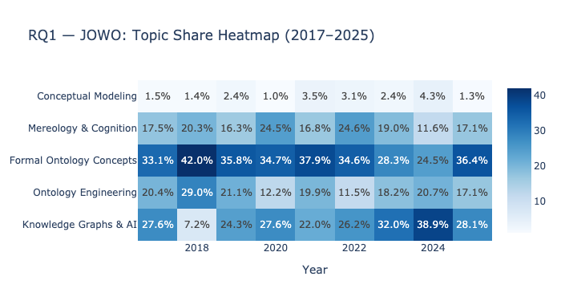
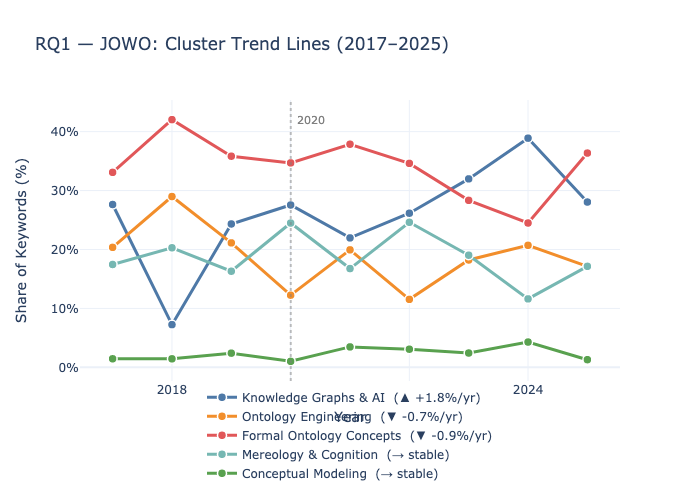
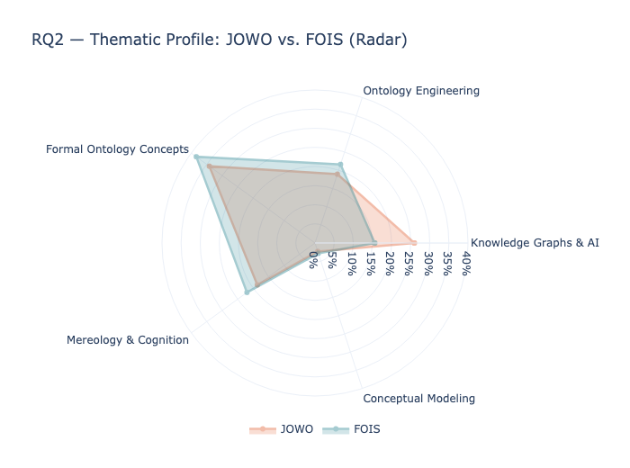
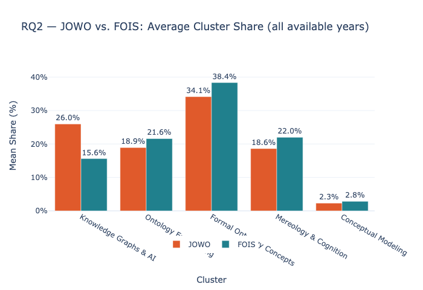
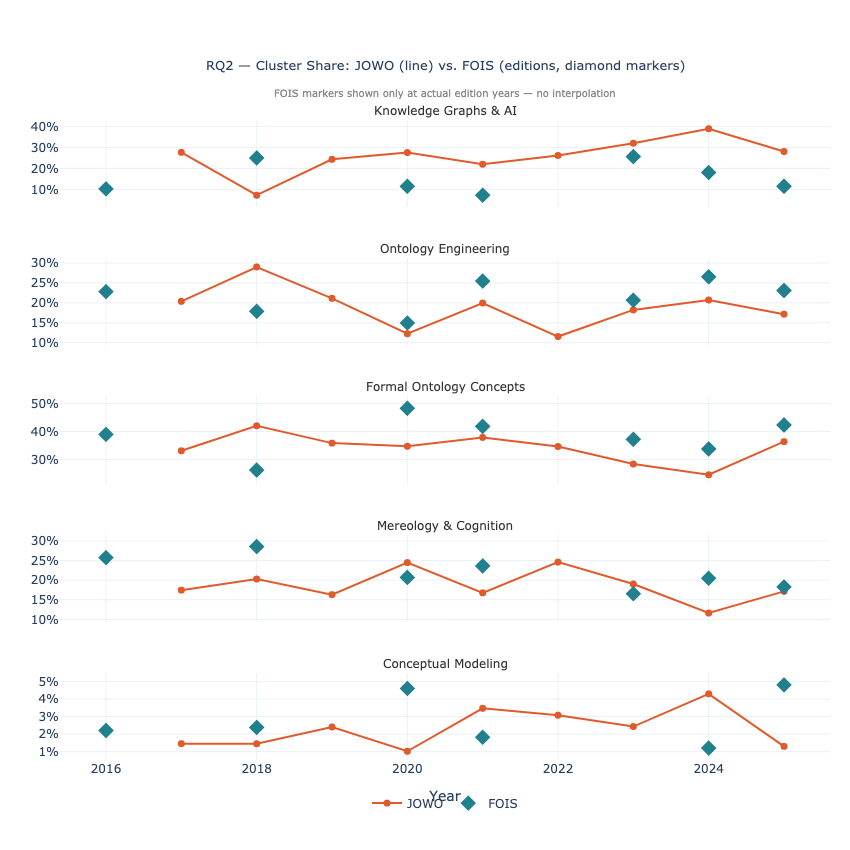

# JOWO Topic Analysis — Report Outline
*Noah Meissner*

---

## 1. Introduction & Motivation

The Joint Ontology Workshops (JOWO) have been held annually since 2015 as a satellite event of FOIS (Formal Ontology in Information Systems), bringing together a broad spectrum of ontology-related workshops under one roof. Over the past decade, the ontology research landscape has shifted considerably — driven by the rise of knowledge graphs, large language models, and applied AI. This raises the question of whether JOWO's thematic focus has followed suit.

**Research Questions:**

> **RQ1**: How has JOWO evolved in terms of topics over the past ten years? Are there emerging trends, or topics that have become less prominent?

> **RQ2**: How does JOWO's thematic profile compare to FOIS — the more selective, formally oriented main conference it accompanies?
---

## 2. Methodology

### 2.1 Data Collection

Paper metadata (title, authors, year, URL) was collected from DBLP using the following conference scope:

```python
conference_dict = {
    "JOWO": [2015, 2016, 2017, 2018, 2019, 2020, 2021, 2022, 2023, 2024, 2025],
    "FOIS": [2016, 2018, 2020, 2021, 2023, 2024, 2025]
}
```



Since DBLP does not provide abstracts, a custom **PDF Extraction Pipeline** was used to extract abstracts and keywords directly from the papers (see `01_Extraction.ipynb`).

#### PDF Extraction Pipeline
A fault-tolerant, multi-stage pipeline:

1. **Download & Parsing**: PDFs are downloaded from CEUR-WS / IOS Press and the first 5 pages are parsed using `PyMuPDF`.
2. **Regex Extraction** *(fast path)*: Regular expressions attempt to locate abstract and keyword sections by matching structural markers (e.g., "Abstract", "Keywords:").
3. **LLM Fallback** *(slow path)*: If regex fails, the extracted text is passed to a local LLM (`phi4-mini` via Ollama) with a structured prompt to recover the missing fields.
4. **Incremental Storage**: Results are written to CSV after each paper, enabling seamless resumption after interruptions.

#### 2.1.1 Pipeline Evaluation
To assess pipeline quality, a sample of 20 papers was annotated manually against ground-truth keywords (collected via a separate CSV), and the following metrics were computed (see `evaluate_extraction.ipynb`):
(!TODO to show)

### 2.2 Keyword Clustering

To identify high-level topics, extracted keywords were clustered using the following pipeline (see `02_Cluster.ipynb`):

1. **Semantic Embeddings**: Each unique keyword was embedded using the `embeddinggemma` model (via Ollama), capturing distributional meaning.
2. **Dimensionality Reduction**: Embeddings were L2-normalized and reduced to 30 dimensions with PCA.
3. **Optimized K-Means**: K-Means was applied for $k \in [5, 24]$; the Silhouette Score selected $k = 5$ as optimal. The 8 raw clusters were then merged by hand into 5 interpretable macro-clusters based on the most frequent keywords in each:

| Cluster ID | Representative keywords | Macro-label |
|---|---|---|
| 0 | knowledge graph, semantic web, knowledge representation, LLMs, machine learning | **Knowledge Graphs & AI** |
| 1 | ontology, basic formal ontology, ontology engineering, applied ontology | **Ontology Engineering** |
| 2 | mereology, realizable entity, mereotopology, semantics, cognition | **Mereology & Cognition** |
| 3 | disposition, OWL, role, UFO, function, BFO, OntoUML | **Formal Ontology Concepts** |
| 4 | conceptual modeling, formal modeling, enterprise modeling, model | **Conceptual Modeling** |

### 3.0 Results
Interactive visualizations were built with Plotly in `03_Analysis.ipynb`:

### 3.1 RQ1 — JOWO Topic Evolution (2017–2025)
> *JOWO 2016 is listed in DBLP but no papers could be extracted. Analysis covers 492 papers across 9 editions (2017–2025).*

#### Cluster shares per year (%)

| Year | KG & AI | Ont. Eng. | Formal Ont. | Mereology | Concept. Mod. | Papers |
|:----:|--------:|----------:|------------:|----------:|--------------:|------:|
| 2017 | 27.6 | 20.4 | 33.1 | 17.5 | 1.5 | 64 |
| 2018 | 7.2 | 29.0 | 42.0 | 20.3 | 1.4 | 15 |
| 2019 | 24.3 | 21.1 | 35.8 | 16.3 | 2.4 | 79 |
| 2020 | 27.6 | 12.2 | 34.7 | 24.5 | 1.0 | 24 |
| 2021 | 22.0 | 19.9 | 37.9 | 16.8 | 3.5 | 79 |
| 2022 | 26.2 | 11.5 | 34.6 | 24.6 | 3.1 | 29 |
| 2023 | 32.0 | 18.2 | 28.3 | 19.0 | 2.4 | 53 |
| 2024 | **38.9** | 20.7 | 24.5 | 11.6 | 4.3 | 79 |
| 2025 | 28.1 | 17.1 | 36.4 | 17.1 | 1.3 | 70 |


#### Trend summary




---

### 3.2 RQ2 — JOWO vs. FOIS
> *FOIS coverage: 7 editions (2016, 2018, 2020, 2021, 2023, 2024, 2025), 145 papers. Comparison uses average cluster shares across all available editions. Direct year-by-year comparison is not used due to FOIS's biennial publication schedule.*





## 4. Discussion & Limitations

| Limitation | Impact | Mitigation |
|---|---|---|
| **Small evaluation sample** (n=20) | Evaluation metrics not statistically robust | Results are indicative; the 0.8% missing rate across the full corpus provides a complementary coverage signal |
| **5 macro-clusters only** | Within-cluster shifts invisible (e.g., LLMs within "KG & AI") | Deliberate tradeoff for interpretability; finer-grained analysis would require more labeled data |
| **FOIS biennial schedule** | Year-for-year trend comparison infeasible | Aggregate means + per-edition divergence heatmap used instead of trend lines |
| **Keyword extraction bias** | Papers with no PDF access or poorly formatted PDFs are excluded | 82–100% coverage per year; excluded papers unlikely to be systematically biased in topic |
| **Cluster assignment subjectivity** | Macro-cluster labels assigned by human inspection | Representative keywords listed; silhouette-optimized k=5 provides objective base |